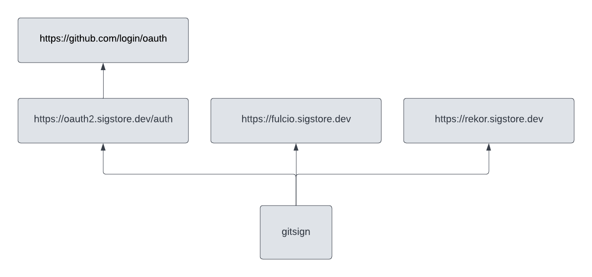

# sigstore-gitsign-demo

## Verify `gitsign` is installed
```
gitsign --version
```

## Configure signing for repository
```
git config --local commit.gpgsign true  # Sign all commits
git config --local tag.gpgsign true  # Sign all tags
git config --local gpg.x509.program gitsign  # Use Gitsign for signing
git config --local gpg.format x509  # Gitsign expects x509 args
```

## Verify commit signature
```
git verify-commit HEAD
```

## gitsign flow


## Inspect commit signature
```
git cat-file commit HEAD | sed -n '/BEGIN/, /END/p' | sed 's/^ //g' | sed 's/gpgsig //g' | sed 's/SIGNED MESSAGE/PKCS7/g' | openssl pkcs7 -print -print_certs -text
```

## Inspect Rekor transparency log
```
uuid=$(rekor-cli search --artifact <(git rev-parse HEAD | tr -d '\n') | tail -n 1)
rekor-cli get --uuid=$uuid --format=json | jq .
```

## Verify commit signature
```
sig=$(rekor-cli get --uuid=$uuid --format=json | jq -r .Body.HashedRekordObj.signature.content)
cert=$(rekor-cli get --uuid=$uuid --format=json | jq -r .Body.HashedRekordObj.signature.publicKey.content)
cosign verify-blob --cert <(echo $cert | base64 --decode) --signature <(echo $sig | base64 --decode) <(git rev-parse HEAD | tr -d '\n')
```

## Configure GitHub connector
```
git config --local gitsign.connectorID https://github.com/login/oauth
```
